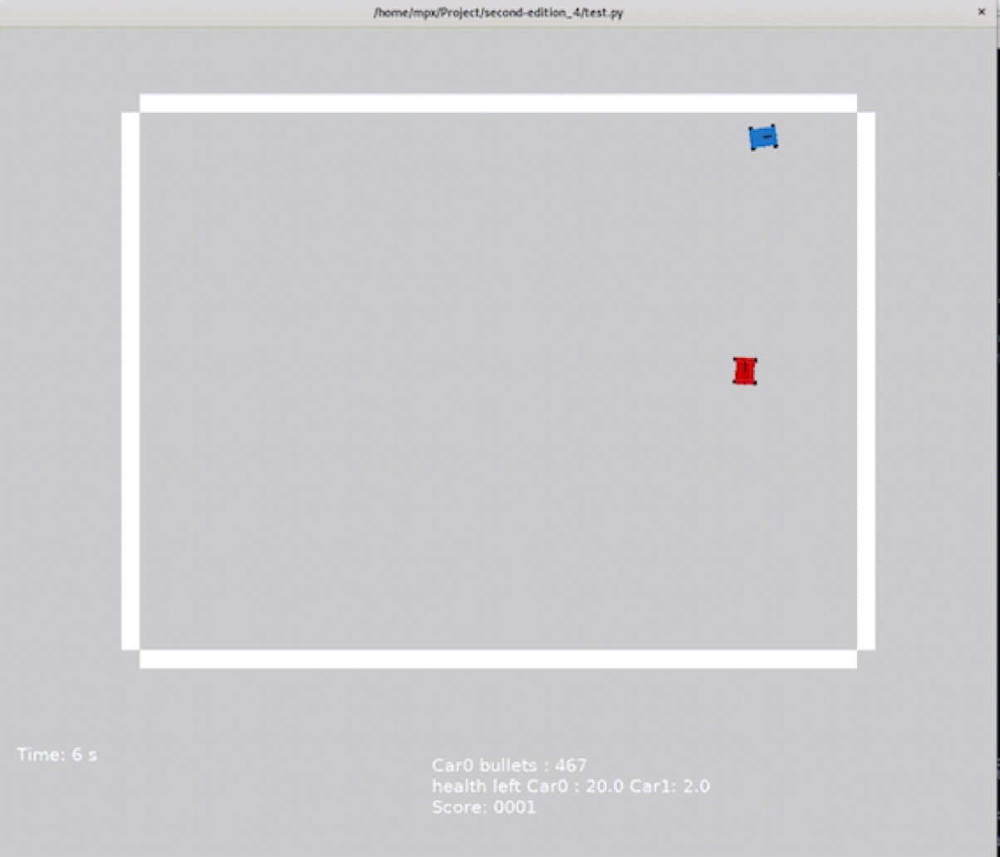
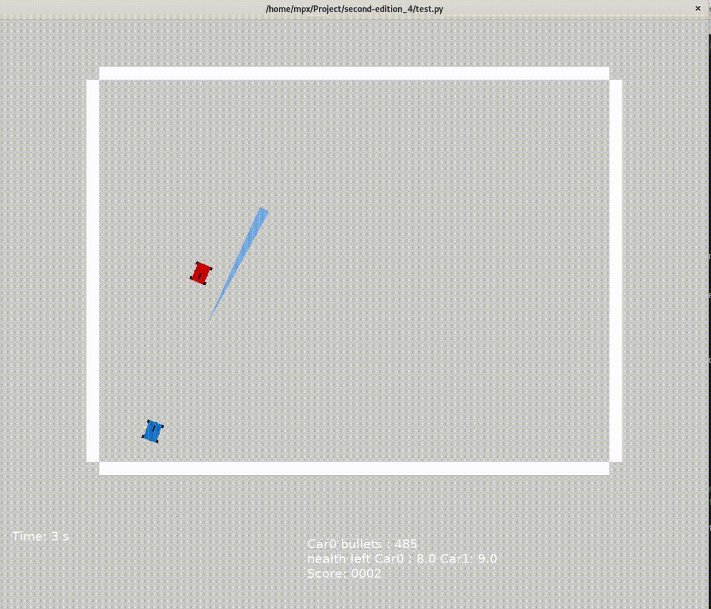
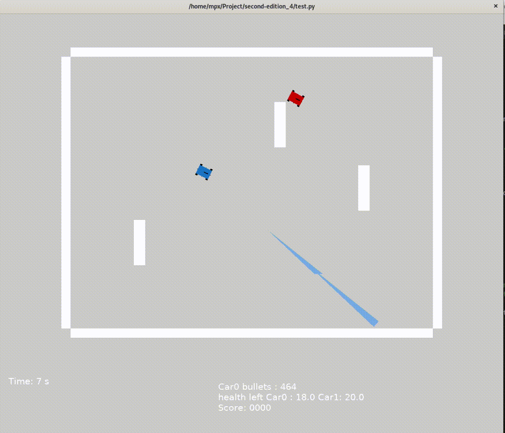
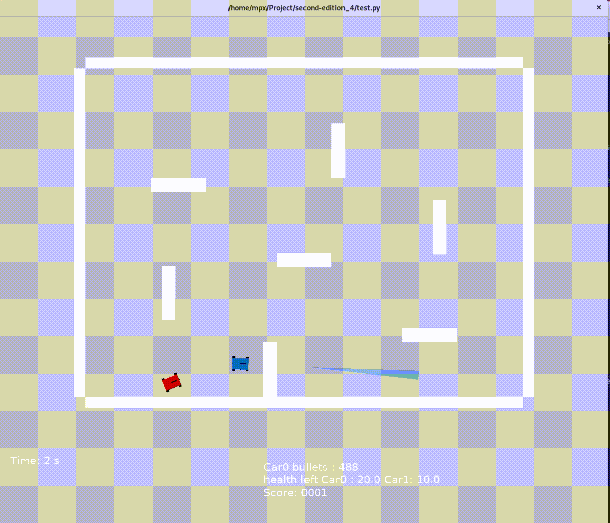
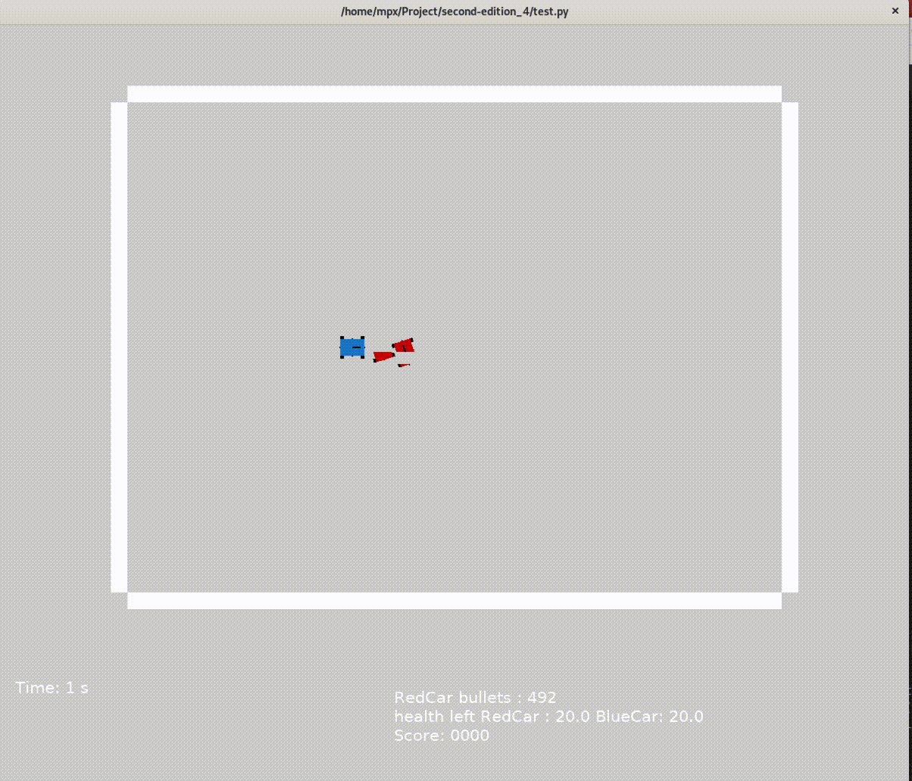
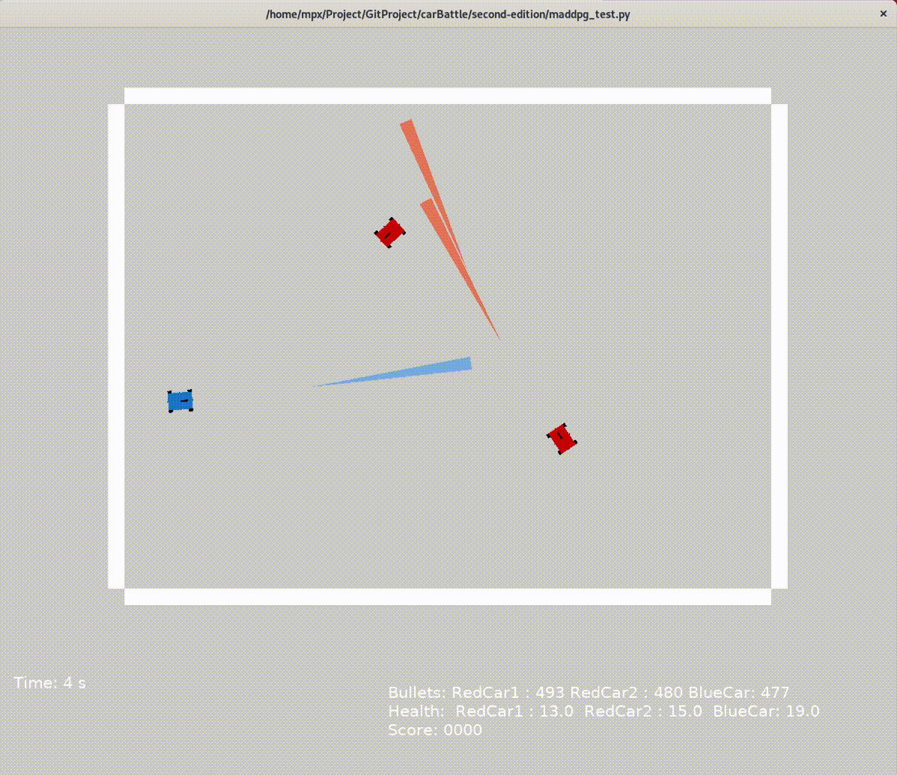

# Deep Reinforcement Learning Car Shooting Battle
## Requirements
- Python3
- Pytorch
- Box2d
- OpenAI gym 

## Introduction

### first-edition (1v1)
There are two cars, red and blue. The red car as an agent, The task of this project is that the red car needs to defeat the blue car as soon as possible. The cars move within the range of the wall. The attack method is laser(simulated based on the actual laser transmitter).There are four laser receiver sensor on the two cars. When the laser collides with the sensor and the car collides, the health will be reduced.When the HP of any car is 0,it will restart. the car uses 1v1 confrontation, The red car uses a deep reinforcement learning method, and the blue car uses random strategy(trained strategy) , Complete the training in an obstacle-free environment and an obstacle environment.Finally, man-machine combat is realized.

### second-edition (2v1)
Two red cars are used as agents and the blue car uses random strategy to start training through multi-agent deep reinforcement learning method (maddpg) and transfer learning.First, the red  cars are close to each other, and then through the way of rotary attack,  they can defeat the blue car while trying to avoid hurting their companions by mistake.

## simulation environment 

| parameter   |  description  |
| ----  | ----  |
| wall | number:4 ; size: 8 x 0.2 & 6 x 0.2 |
| car | size: 0.3 x 0.21 |
| laser | shape: Isosceles triangle ; size:（botom: 0.16 height: 2） |
| gun | size:0.2 x 0.02 |
| sensor | number:4 ; size: 0.01 x 0.01 |
| wheel | number:4 ; size: 0.1 x 0.06 |

## run

### first-version
#### 1.0 
The red car uses td3 strategy and the blue car uses random strategy to start training in the obstacle-free  environment

#### 1.1 
The red car uses td3 strategy and the blue car uses 1.0 strategy to start training in the obstacle-free free environment

#### 1.2 
The red car uses td3 strategy and the blue car uses random strategy to start training in the few-obstacle enviroment

#### 1.3 
The red car uses td3 strategy and the blue car uses random strategy to start training in the multi-obstacle enviroment

#### 1.4 
man-machine combat 
- W: forwad(muzzle pointing direction)
- S: backward
- A: turn left
- D: turn right
- Space : shoot

### second-version
The red cars use MADDPG and the blue car uses random strategy to start training in the obstacle-free enviroment

## Reference:
- Box2d manual：https://github.com/pybox2d/pybox2d/wiki/manual 
- JachinShen：https://github.com/JachinShen/supreme-invention

